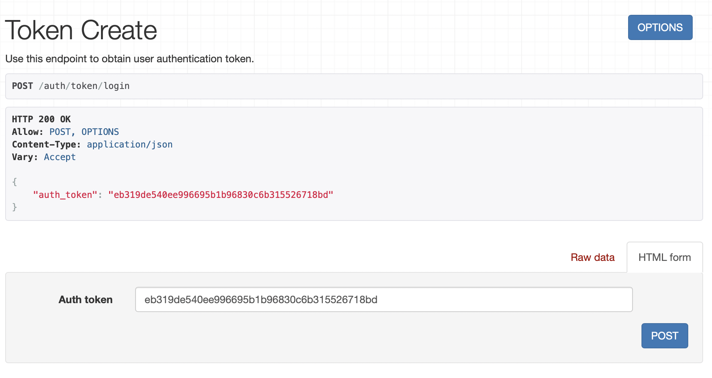

# Лабораторная работа 3. Реализация серверной части на django rest. Документирование API.

API пограммной системы, предназначенной для хранения информации о торгах на товарно-сырьевой бирже.

## Схема базы данных


## Пути доступа к моделям
По приведенным ниже путям можно получить список всех обьектов модели.

### Производитель
```
/exchange/manufacturer
```
### Тип товара
```
/exchange/producttype
```
### Товар
```
/exchange/product
```
### Брокер
```
/exchange/broker
```
### Партия
```
/exchange/consignment
```
### Товар в партии
```
/exchange/productinconsignment
```

>Также для каждой модели доступны:
> - создание нового объекта `<modelpath>/create`
> - просмотр одного объекта `<modelpath>/<id>`
> - редактирование объекта `<modelpath>/<id>/edit`
> - удаление объекта `<modelpath>/<id>/delete`

### Примеры
Список


Создание


Один объект


Редактирование


Удаление


## Эндпоинты
Согласно варианту реализованы эндпоинты, соответствующие переченю возможных запросов к базе данных.

### Сколько единиц товара каждого вида выставлено на продажу от и до заданной даты
GET-запрос должен содержать обязательные параметры:
- `date_from=<YYYY-MM-DD>`
- `date_until=<YYYY-MM-DD>`
```
/exchange/productsbytypeanddate/?date_from=<YYYY-MM-DD>&date_until=<YYYY-MM-DD>
```


### Найти фирму-производителя товаров, которая за заданный период времени выручила максимальную сумму денег
GET-запрос должен содержать обязательные параметры:
- `date_from=<YYYY-MM-DD>`
- `date_until=<YYYY-MM-DD>`
```
/exchange/topmanufacturerbydate/?date_from=<YYYY-MM-DD>&date_until=<YYYY-MM-DD>
```


### Найти товары, которые никогда не выставляли на продажу брокеры заданной конторы
GET-запрос должен содержать обязательный параметр:
- `company=<company-name>`
```
/exchange/productsnotsoldbycompany/?company=<company-name>
```


### Найти все факты выставления на продажу товаров с просроченной годностью
```
/exchange/expiredproducts
```


### Найти зарплату всех брокеров заданной конторы
GET-запрос должен содержать обязательный параметр:
- `company=<company-name>`
```
/exchange/brokersalarybycompany/?company=<company-name>
```


## Авторизация
Для доступа к API необходима авторизация с помощью токена.

### Создание пользователя
POST-запрос по пути:
```
/auth/users
```
Поля в теле запроса:
- `first_name`
- `last_name`
- `email`
- `username`
- `password`


### Получение токена
POST-запрос по пути:
```
/auth/token/login
```
Поля в теле запроса:
- `username`
- `password`



### Использование токена в запросе
Далее во все запросы к API нужно добавить заголовок 
с ключом `Authorization` и значением `Token <current-user-token>`

### Доступ к текущему аутентифицированному пользователю
GET-запрос по пути:
```
/auth/users/me
```

