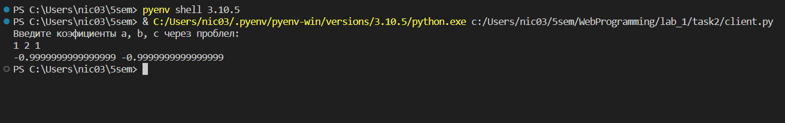
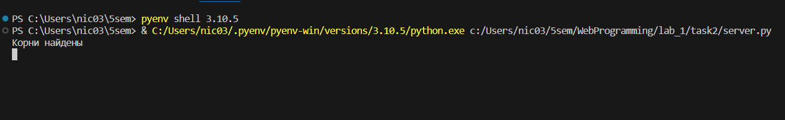
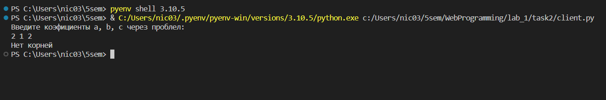
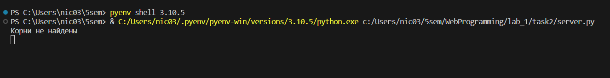

# Задание 2

### Текст задания

>*Реализовать клиентскую и серверную часть приложения. Клиент запрашивает у*
>*сервера выполнение математической операции, параметры, которые вводятся с*
>*клавиатуры. Сервер обрабатывает полученные данные и возвращает результат*
>*клиенту.* 
>
>* *Мой вариант: Решение квадратного уравнения*
>* *Обязательно использовать библиотеку `socket`*
>* *Реализовать с помощью протокола `TCP`*

### Код

``` py title="server.py"
import socket
from numpy import polynomial 

sock = socket.socket(socket.AF_INET, socket.SOCK_STREAM)
sock.bind(('127.0.0.1', 49001))  
sock.listen(1)

conn, adr = sock.accept()

while True:
    try:
        data = conn.recv(1024).decode("utf-8")
        data = data.split()
        a, b, c = int(data[0]), int(data[1]), int(data[2])

        if (b*b - 4*a*c) >= 0:
            pol = polynomial.Polynomial([a, b, c])
            pol = pol.roots()
            roots = str(pol[0]) + ' ' + str(pol[1])
            print('Корни найдены')
        else:
            roots = "Нет корней"
            print('Корни не найдены')
        conn.send(roots.encode())
    except:
        conn.close()
        
```

``` py title="client.py"
import socket


sock = socket.socket(socket.AF_INET, socket.SOCK_STREAM)
sock.connect(('127.0.0.1', 49001)) 

print('Введите коэфициенты a, b, c через проблел:')

try:
    a, b, c = map(str, input().split())
    coef = a + ' ' + b + ' ' + c
    sock.send(coef.encode())
    data = sock.recv(1024).decode("utf-8")
    print(data)
except:
    print('Какая-то ошибка')
    sock.close()

```

### Пример работы




 