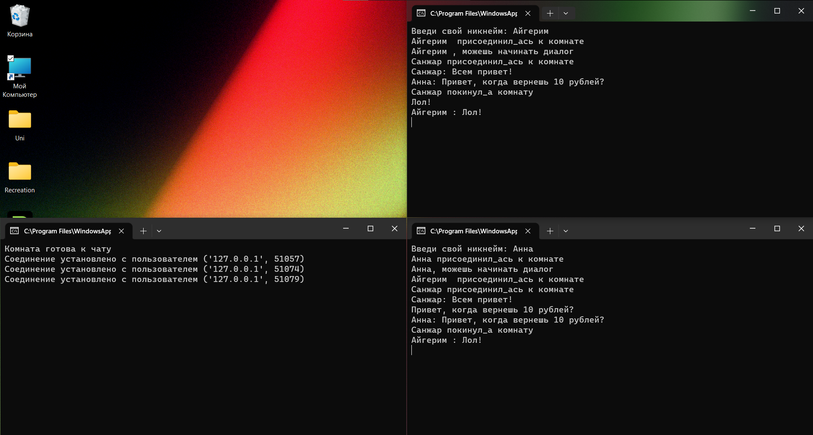

# Задание 4

### Текст задания

>*Реализовать двухпользовательский или многопользовательский чат. Реализация*
>*многопользовательского часа позволяет получить максимальное количество*
>*баллов.*
>
>* *Обязательно использовать библиотеку `threading`.*

### Код

``` py title="server.py"
import socket
import threading

sock = socket.socket(socket.AF_INET, socket.SOCK_STREAM)
sock.bind(('127.0.0.1', 49001))  
sock.listen()

clients = []
nicknames = []

def broadcast(message):
    for client in clients:
        client.send(message)

def handel_client(client):
    while True:
        try:
            message = client.recv(1024)
            broadcast(message)
        except:
            index = clients.index(client)
            clients.remove(client)
            client.close()
            nickname = nicknames[index]
            broadcast(f"{nickname} покинул_а комнату".encode('utf-8'))
            nicknames.remove(nickname)
            break

def recieve():
    print("Комната готова к чату")
    while True:
        client, adress = sock.accept()
        print(f'Соединение установлено с пользователем {str(adress)}')
        client.send('nickname?'.encode('utf-8'))
        nickname = client.recv(1024).decode('utf-8')
        nicknames.append(nickname)
        clients.append(client)
        broadcast(f'{nickname} присоединил_ась к комнате'.encode('utf-8'))
        client.send(f'{nickname}, можешь начинать диалог'.encode('utf-8'))
        thread = threading.Thread(target = handel_client, args=(client,))
        thread.start()

if __name__ == "__main__":
    recieve()

```

``` py title="client.py"
import socket
import threading

nickname = input('Введи свой никнейм: ')
sock = socket.socket(socket.AF_INET, socket.SOCK_STREAM)
sock.connect(('127.0.0.1', 49001))  

def client_recieve():
    while True:
        try:
            message = sock.recv(1024).decode('utf-8')
            if message == "nickname?":
                sock.send(nickname.encode('utf-8'))
            else:
                print(message)
        except:
            print("Error")
            sock.close()
            break

def client_send():
    while True:
        message = f'{nickname}: {input()}'
        sock.send(message.encode('utf-8'))

recieve_thread = threading.Thread(target = client_recieve)
recieve_thread.start()

send_thread = threading.Thread(target = client_send)
send_thread.start()

```

### Пример работы

