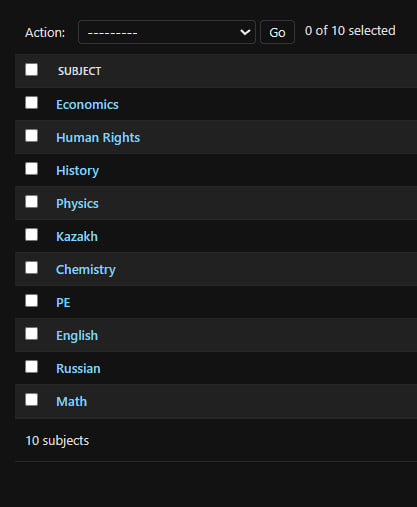

# Описание моделей

Модели я создавал в одном приложении - `Journal`. Модели отвечают за работу с домашними заданиями и распределением обязанностей и прав пользователей. Давайте разберемся подробнее:

## Journal

Всего у меня пять объектов, которые отвечают за работу всего приложения. Код целиком представлен внизу:

``` py title="journal/models.py"
from django.db import models
from django.contrib.auth.models import User
from django.urls import reverse
from django.utils import timezone 
from django.dispatch import receiver
from django.db.models.signals import post_save
from ckeditor.fields import RichTextField

class Homework(models.Model):
    subject = models.CharField(max_length=50)
    tutor = models.ForeignKey(User, on_delete=models.CASCADE)
    body = RichTextField(blank=True, null=True)
    start_date = models.DateTimeField(default=timezone.now)
    end_date = models.DateTimeField(default=timezone.now)
    student_class = models.CharField(max_length=3)
      
    def __str__(self):
        return self.subject + ' | ' + str(self.tutor)
    
    def get_absolute_url(self):
        return reverse('homework-page', args=(self.pk,))

class Profile(models.Model):
    user = models.OneToOneField(User, null=True, on_delete=models.CASCADE)
    role = models.CharField(blank=True, max_length=10, choices=[('teacher', 'Teacher'), ('student', 'Student')])
    student_class = models.CharField(max_length=3, blank=True, null=True)
    subjects = models.ManyToManyField('Subject', blank=True, related_name='teachers')

    def __str__(self):
        return str(self.user)

@receiver(post_save, sender=User)
def create_user_profile(sender, instance, created, **kwargs):
    if created:
        Profile.objects.create(user=instance)

class Subject(models.Model):
    name = models.CharField(max_length=100, unique=True)

    def __str__(self):
        return self.name

class SubmittedHomework(models.Model):
    student = models.ForeignKey(User, on_delete=models.CASCADE)
    homework = models.ForeignKey(Homework, on_delete=models.CASCADE)
    submitted_at = models.DateTimeField(default=timezone.now)
    homework_body = RichTextField(blank=True, null=True)
    grade = models.PositiveIntegerField(default=0, null=True, blank=True)
    status = models.CharField(max_length=20, choices=[('issued', 'Issued'), ('pending_review', 'Pending Review'), ('graded', 'Graded')])
    submitted = models.BooleanField(default=False)

    def __str__(self):
        return f"{self.student.username}'s submission for {self.homework.subject}"
    
class GradeJournal(models.Model):
    student = models.ForeignKey(User, on_delete=models.CASCADE)
    subject = models.CharField(max_length=50)
    grade = models.PositiveIntegerField(null=True, blank=True)
    homework = models.ForeignKey(SubmittedHomework, on_delete=models.CASCADE)

    def __str__(self):
        return f"{self.student.username}'s grade for {self.subject}"
    
```
### Немного деталей

Теперь разберемся глубже, что отвечает за что.

Объект `Profile` хранит в себе основные входные данные о юзере через связь с `User`. Так, можно узнать имя, фамилию, ник и почту пользователя. Остальные поля хранят в себе информацию о типе пользователя (ученик или учитель), учебном классе (если пользователь - ученик) и предметах, которые ведет преподаватель (если пользователь - преподаватель). К настройке данных о пользователе доступ имеет только админ, который и распределяет роли между пользователями. Как только пользователь зарегистировался на сайте, у него появляется свой `Profile`.

#### Пример работы


Объект `Subject` хранит в себе информацию о всех предметах, которые потом админом раздаются учителям. Объект напрямую связан с `Profile`.

#### Пример работы



Объект `Homework` хранит в себе информацию о выданном учителем задании. Там есть информация про дедлайны, учебный класс, поле с самим заданием и информация об учителе, который выдал домашнее задание.

#### Пример работы


Объект `SubmittedHomework` хранит в себе информацию о выданном учителем задании у ученика. После выдачи учителем домашнего задания, объект создается у каждого ученика, кому это домашнее задание положено. Там определен статус домашнего задания: "Выдано", "На проверке" и "Оценено", сама оценка и текст домашнего задания, который выполняет ученик.

#### Пример работы


Объект `GradeJournal` хранит в себе информацию об оценках за домашние работы, на основании которых формируется индивидуальный журнал ученика.

#### Пример работы


