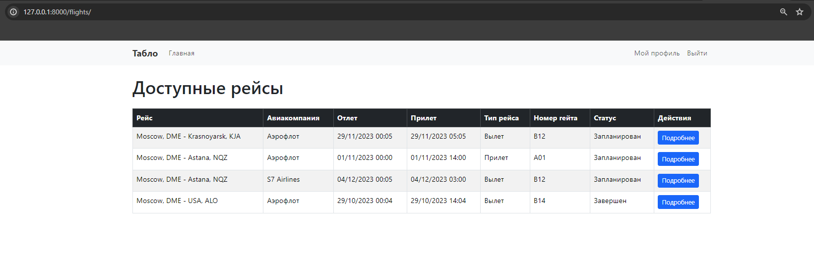
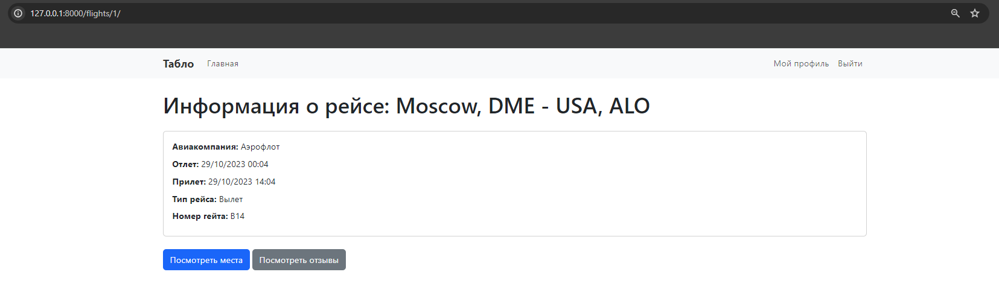
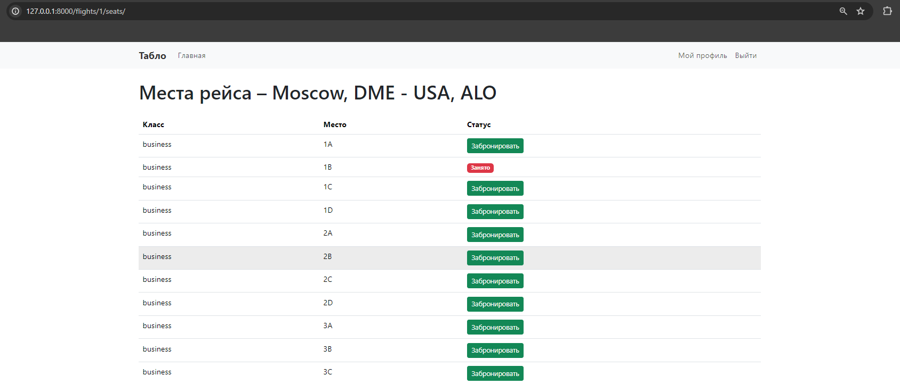
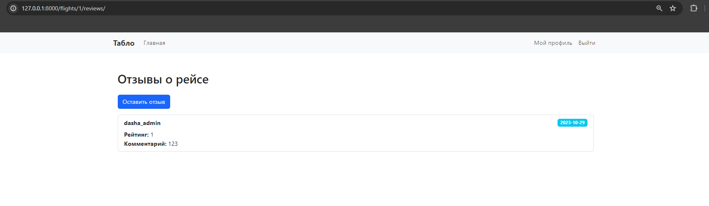
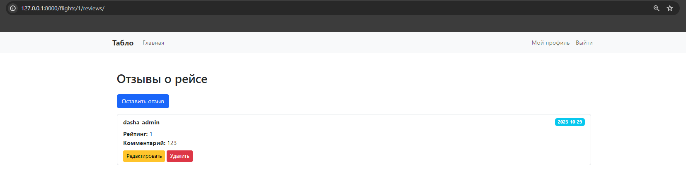
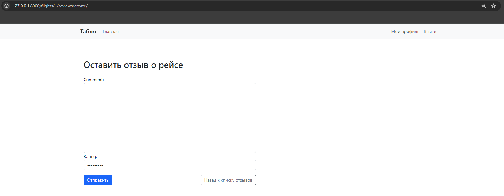
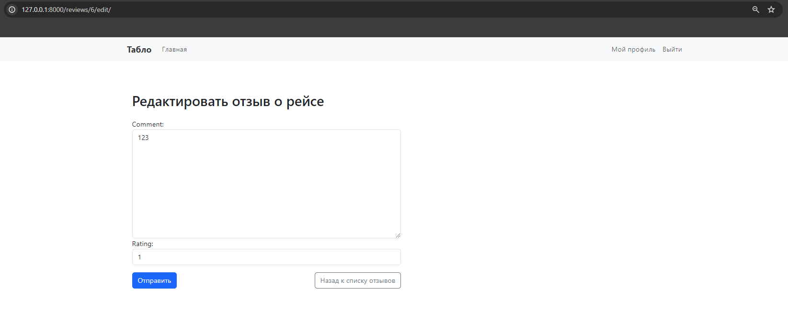
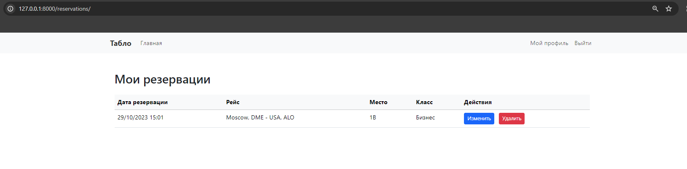
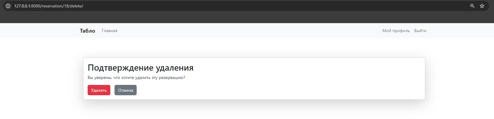

# Скриншоты представлений приложения Flights

В этом разделе представлены скриншоты страниц, используемых в приложении Flights.

## Список представлений:

- **IndexRedirectView**  
  

- **FlightDetailView**  
  

- **FlightSeatsDetailView**  
  

- **ReviewListView (для неавторизованных пользователей)**  
  

- **ReviewListView (для авторизованных пользователей)**  
  

- **ReviewCreateView**  
  

- **ReviewUpdateView**  
  

- **ReservationListView**  
  

- **ReservationDeleteView**  
  
