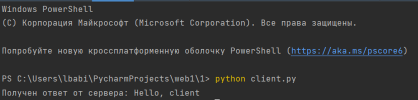
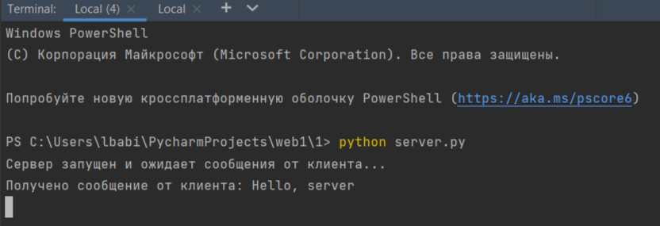

## Задача №1

Реализовать клиентскую и серверную часть приложения. Клиент отсылает 
серверу сообщение “Hello, server”. Сообщение должно отразиться на 
сервере.
Сервер в ответ отсылает клиенту сообщение «Hello, client». Сообщение 
должно отобразиться у клиента.
Обязательно использовать библиотеку socket.
Реализовать с использованием протокола UDP.

## Решение

1. Сервер

```
import socket

server_socket = socket.socket(socket.AF_INET, socket.SOCK_DGRAM)

server_address = ('localhost', 12345)
server_socket.bind(server_address)

print('Сервер запущен и ожидает сообщения от клиента...')

while True:
    data, client_address = server_socket.recvfrom(1024)
    message = data.decode('utf-8')

    print('Получено сообщение от клиента:', message)

    response = 'Hello, client'
    server_socket.sendto(response.encode('utf-8'), client_address)
```
2. Клиент

```
import socket

client_socket = socket.socket(socket.AF_INET, socket.SOCK_DGRAM)

server_address = ('localhost', 12345)

message = 'Hello, server'
client_socket.sendto(message.encode('utf-8'), server_address)

response, _ = client_socket.recvfrom(1024)
response_message = response.decode('utf-8')

print('Получен ответ от сервера:', response_message)

client_socket.close()
```

## Пример работы программы

**Серверная часть**
**Клиентская часть**