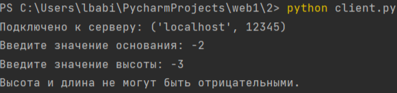
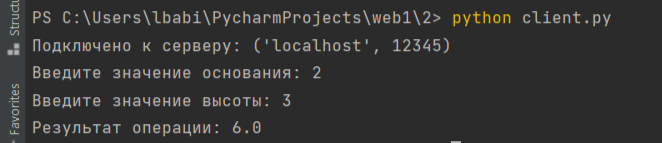

## Задача №2

Реализовать клиентскую и серверную часть приложения. Клиент запрашивает у сервера выполнение математической операции, параметры которой вводятся с клавиатуры. 
Сервер обрабатывает полученные данные и возвращает результат клиенту. 

Мой вариант, согласно списку группы, – теорема Пифагора.

## Решение

1. Сервер

```
import socket

server_socket = socket.socket(socket.AF_INET, socket.SOCK_STREAM)

server_address = ('localhost', 12345)
server_socket.bind(server_address)

server_socket.listen(1)
print('Сервер запущен и ожидает подключения клиента...')

while True:
    client_socket, client_address = server_socket.accept()
    print('Подключился клиент:', client_address)

    base = float(client_socket.recv(1024).decode('utf-8'))
    height = float(client_socket.recv(1024).decode('utf-8'))

    area = base * height

    client_socket.send(str(area).encode('utf-8'))

    client_socket.close()
```

2. Клиент

```
import socket

client_socket = socket.socket(socket.AF_INET, socket.SOCK_STREAM)

server_address = ('localhost', 12345)

client_socket.connect(server_address)
print('Подключено к серверу:', server_address)

base = float(input('Введите значение основания: '))
height = float(input('Введите значение высоты: '))

if base < 0 or height < 0:
    print('Высота и длина не могут быть отрицательными.')
    client_socket.close()
    exit()

client_socket.send(str(base).encode('utf-8'))
client_socket.send(str(height).encode('utf-8'))

result = client_socket.recv(1024).decode('utf-8')

print('Результат операции:', result)

client_socket.close()
```

## Демонстрация работы
**Клиентская часть**
**Клиентская часть**
