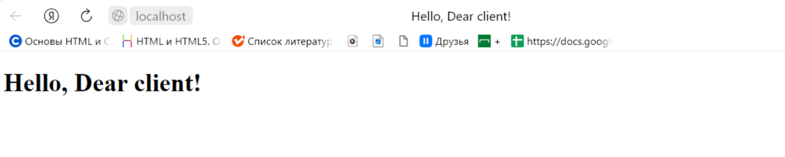

## Задача №3

Реализовать серверную часть приложения. Клиент подключается к серверу. 
В ответ клиент получает http-сообщение, содержащее html-страницу, 
которую сервер подгружает из файла index.html.

## Решение

1. Сервер

```
import socket

server_socket = socket.socket(socket.AF_INET, socket.SOCK_STREAM)

server_address = ('localhost', 80)
server_socket.bind(server_address)

server_socket.listen(1)
print('Сервер запущен и ожидает подключения клиента...')

while True:
    client_socket, client_address = server_socket.accept()
    print('Подключился клиент:', client_address)

    with open('index.html', 'r') as file:
        html_content = file.read()

    http_response = 'HTTP/1.1 200 OK\r\n'
    http_response += 'Content-Type: text/html\r\n'
    http_response += '\r\n'
    http_response += html_content

    client_socket.send(http_response.encode('utf-8'))

    client_socket.close()
```

## Демонстрация работы
**При переходе по нужному сокету в браузере видим html**