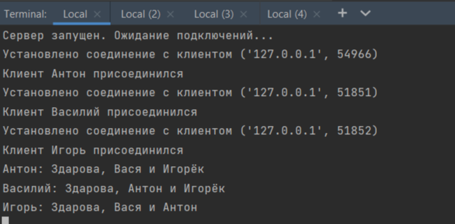
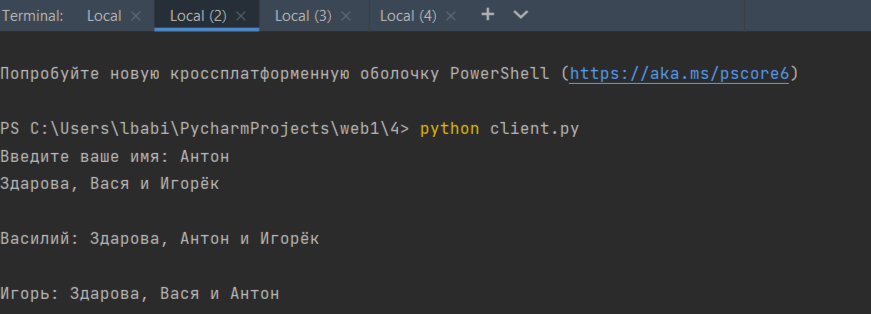
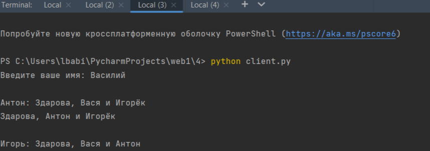
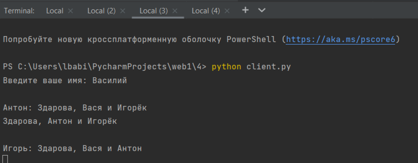

## Задача №3

Реализовать двухпользовательский или многопользовательский чат. 
Реализация многопользовательского чата позволяет получить максимальное количество баллов.


## Решение

1. Сервер

```
import threading
import socket

def handle_client(client_socket, client_name):
    while True:
        try:
            message = client_socket.recv(1024).decode('utf-8')
            if message:
                print(f'{client_name}: {message}')
                broadcast_message(client_name, message)
        except:
            print(f'Потеряно соединение с клиентом {client_name}')
            client_socket.close()
            break

def broadcast_message(sender_name, message):
    for client_socket, name in CLIENTS:
        if name != sender_name:
            try:
                client_socket.send(f'{sender_name}: {message}'.encode('utf-8'))
            except:
                print(f'Ошибка при отправке сообщения клиенту {name}')
                client_socket.close()
                remove_client(client_socket, name)

def remove_client(client_socket, client_name):
    for client in CLIENTS:
        if client[0] == client_socket and client[1] == client_name:
            CLIENTS.remove(client)
            break

def start_server():
    server_socket = socket.socket(socket.AF_INET, socket.SOCK_STREAM)
    server_socket.bind(('localhost', 12345))
    server_socket.listen(5)
    print('Сервер запущен. Ожидание подключений...')

    while True:
        client_socket, client_address = server_socket.accept()
        print(f'Установлено соединение с клиентом {client_address}')

        client_name = client_socket.recv(1024).decode('utf-8')
        print(f'Клиент {client_name} присоединился')

        CLIENTS.append((client_socket, client_name))

        client_thread = threading.Thread(target=handle_client, args=(client_socket, client_name))
        client_thread.start()

CLIENTS = []

server_thread = threading.Thread(target=start_server)
server_thread.start()
```

2. Клиент

```
import threading
import socket

def handle_server(server_socket):
    while True:
        try:
            message = server_socket.recv(1024).decode('utf-8')
            if message:
                print('\n' + message)
        except:
            print('Потеряно соединение с сервером')
            server_socket.close()
            break

def start_client():
    client_name = input('Введите ваше имя: ')

    client_socket = socket.socket(socket.AF_INET, socket.SOCK_STREAM)
    client_socket.connect(('localhost', 12345))

    client_socket.send(client_name.encode('utf-8'))

    client_thread = threading.Thread(target=handle_server, args=(client_socket,))
    client_thread.start()

    while True:
        message = input()
        client_socket.send(message.encode('utf-8'))

client_thread = threading.Thread(target=start_client)
client_thread.start()
```


## Демонстрация работы
**Запуск server.py:**
**Юзер 1**
**Юзер 2**
**Юзер 3**