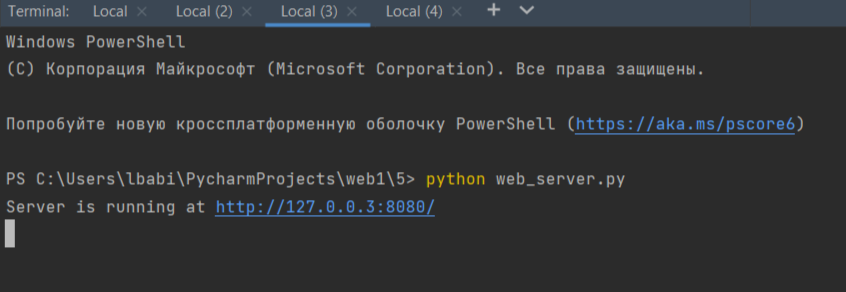
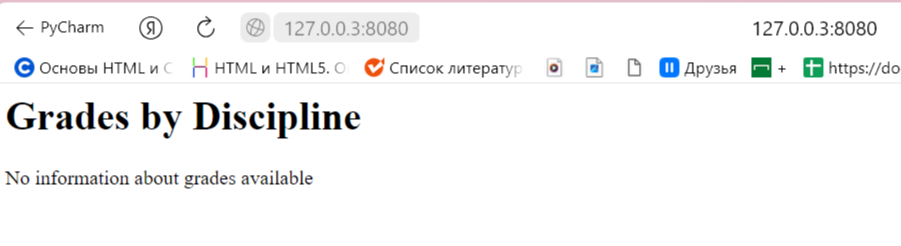
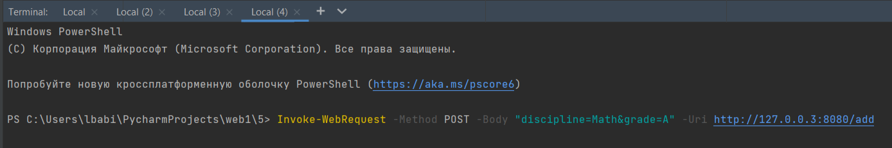
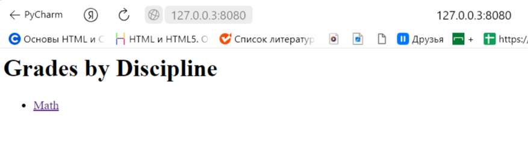
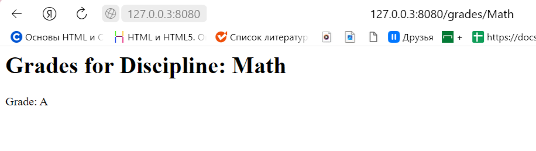

## Задание №5

Необходимо написать простой web-сервер для обработки GET и POST http
запросов средствами Python и библиотеки socket.

## Решение

1. web-server

```
import socket

class WebServer:
    def __init__(self, host, port):
        self.host = host
        self.port = port
        self.data = {}  # Словарь для хранения информации о дисциплине и оценке

    def start(self):
        server_socket = socket.socket(socket.AF_INET, socket.SOCK_STREAM)
        server_socket.setsockopt(socket.SOL_SOCKET, socket.SO_REUSEADDR, 1)
        server_socket.bind((self.host, self.port))
        server_socket.listen(1)
        print(f"Server is running at http://{self.host}:{self.port}/")

        while True:
            client_socket, client_address = server_socket.accept()
            request = client_socket.recv(1024).decode()
            if request:
                response = self.handle_request(request)
                client_socket.sendall(response.encode())
            client_socket.close()

    def handle_request(self, request):
        headers = request.split("\r\n")
        method, path, version = headers[0].split(" ")

        if method == "GET":
            if path == "/":
                return self.get_homepage()
            elif path.startswith("/grades/"):
                discipline = path.split("/")[2]
                return self.get_grades(discipline)
        elif method == "POST":
            if path == "/add":
                return self.handle_add_request(headers[-1])

        return self.not_found()

    def get_homepage(self):
        content = "<h1>Grades by Discipline</h1>"
        if self.data:
            content += "<ul>"
            for discipline, grade in self.data.items():
                content += f"<li><a href='/grades/{discipline}'>{discipline}</a></li>"
            content += "</ul>"
        else:
            content += "<p>No information about grades available</p>"

        response = "HTTP/1.1 200 OK\r\n"
        response += "Content-Type: text/html\r\n"
        response += "Connection: close\r\n"
        response += f"Content-Length: {len(content)}\r\n"
        response += "\r\n"
        response += content

        return response

    def get_grades(self, discipline):
        content = "<h1>Grades for Discipline: {}</h1>".format(discipline)
        if discipline in self.data:
            grade = self.data[discipline]
            content += "<p>Grade: {}</p>".format(grade)
        else:
            content += "<p>No information available for the specified discipline</p>"

        response = "HTTP/1.1 200 OK\r\n"
        response += "Content-Type: text/html\r\n"
        response += "Connection: close\r\n"
        response += f"Content-Length: {len(content)}\r\n"
        response += "\r\n"
        response += content

        return response

    def handle_add_request(self, data):
        data = data.split("&")
        discipline = data[0].split("=")[1]
        grade = data[1].split("=")[1]
        self.data[discipline] = grade

        return self.get_homepage()

    def not_found(self):
        response = "HTTP/1.1 404 Not Found\r\n"
        response += "Content-Type: text/plain\r\n"
        response += "Connection: close\r\n"
        response += "Content-Length: 9\r\n"
        response += "\r\n"
        response += "Not Found"

        return response

if __name__ == "__main__":
    server = WebServer("127.0.0.3", 8080)
    server.start()
```

## Демонстрация работы
**Запускаем сервер**
**Проверяем страницу**
**Добавляем предмет и оценку**
**Проверяем**