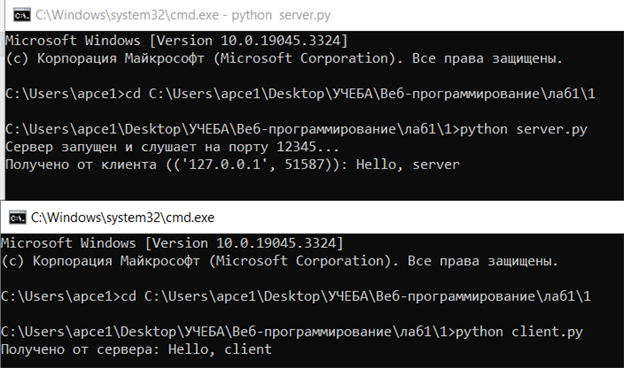

## Задание №1

---
**Задача:** 

Реализовать клиентскую и серверную часть приложения. Клиент отсылает серверу сообщение "Hello, server". Сообщение должно отразиться на стороне сервера. Сервер в ответ отсылает клиенту сообщение "Hello, client". Сообщение должно отобразиться у клиента.

**Требования:**

- Обязательно использовать библиотеку socket.
- Реализовать с помощью протокола UDP.

---
## Решение

**client.py**
```python
import socket

# Создаем сокет для UDP
client_socket = socket.socket(socket.AF_INET, socket.SOCK_DGRAM)

# Адрес и порт сервера
server_address = ('localhost', 12345)

# Сообщение для отправки серверу
message = "Hello, server"

# Отправляем сообщение серверу
client_socket.sendto(message.encode(), server_address)

# Принимаем ответ от сервера
data, _ = client_socket.recvfrom(1024)

# Выводим полученный ответ от сервера
print(f"Получено от сервера: {data.decode()}")

# Закрываем сокет клиента
client_socket.close()
```


**server.py**

```python
import socket

# Создаем сокет для UDP
server_socket = socket.socket(socket.AF_INET, socket.SOCK_DGRAM)

# Привязываем сокет к адресу и порту
server_address = ('localhost', 12345)
server_socket.bind(server_address)

print("Сервер запущен и слушает на порту 12345...")

while True:
    # Принимаем данные от клиента и его адрес
    #сервер получает сообщение от клиента и сохраняет это сообщение в переменной data
    data, client_address = server_socket.recvfrom(1024) #это команда для сервера, а 1024 количество байт короче

    # Выводим полученные данные от клиента
    print(f"Получено от клиента ({client_address}): {data.decode()}")

    # Отправляем ответ клиенту
    response = "Hello, client"
    server_socket.sendto(response.encode(), client_address)
```


---
##Результат работы программы

**Страница клиента (client.py)**

- Создает UDP сокет.
- Отправляет сообщение "Hello, server" на сервер.
- Принимает ответ от сервера.
- Выводит полученный ответ от сервера.

**Страница сервера (server.py)**

- Создает UDP сокет и привязывает его к определенному адресу и порту.
- Принимает данные от клиента.
- Выводит полученные данные от клиента.
- Отправляет ответ "Hello, client" клиенту.



