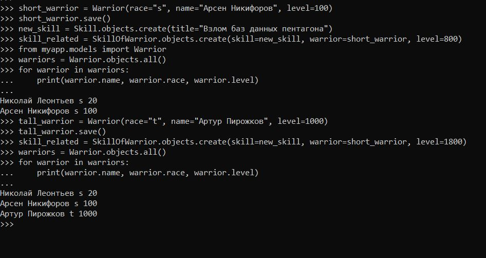

#Практическое занятие №3.1

##Задача 1

Шаг 1:
cd C:\Users\apce1\Desktop\УЧЕБА\Веб-программирование\ITMO_ICT_WebDevelopment_2023-2024\students\к3343d\practical_works\Nikiforov_Arsen\pw3

Шаг 2:
 manage.py shell

Шаг 3: импорт
from your_app.models import Warrior, Skill, SkillOfWarrior

Шаг 4: новый воин
short_warrior = Warrior(race="s", name="Николай Леонтьев", level=20)
short_warrior.save()

Шаг 5: новый навык
new_skill = Skill.objects.create(title="Взлом компьютера")

Шаг 6: Привязал новый навык к созданному воину
skill_related = SkillOfWarrior.objects.create(skill=new_skill, warrior=short_warrior, level=15)

Шаг 7: Вывод инфы
from myapp.models import Warrior

warriors = Warrior.objects.all()
for warrior in warriors:
    print(warrior.name, warrior.race, warrior.level)


теория:
SkillOfWarrior.objects.create: Это создание нового объекта модели SkillOfWarrior. 
SkillOfWarrior.objects - менеджер запросов, который позволяет взаимодействовать с объектами модели SkillOfWarrior. 
Метод create создает новый объект в базе данных.

skill=new_skill: Это присвоение полю skill нового объекта Skill. 
Мы создали предварительно новый навык (new_skill) и теперь связываем его с создаваемым объектом SkillOfWarrior.

warrior=short_warrior: Аналогично предыдущему, это присвоение полю warrior объекта short_warrior. 
Мы связываем создаваемый объект с воином (short_warrior).

level=15: Это присвоение полю level значения 15. 
Мы указываем уровень навыка для создаваемого объекта.

Создается новый объект модели SkillOfWarrior, 
который связывает новый навык (new_skill) с созданным воином 
(short_warrior) и указывает уровень навыка (level=15).




Пример:
```
>>> short_warrior = Warrior(race="s", name="Арсен Никифоров", level=100)
>>> short_warrior.save()
>>> new_skill = Skill.objects.create(title="Взлом баз данных пентагона")
>>> skill_related = SkillOfWarrior.objects.create(skill=new_skill, warrior=short_warrior, level=800)
>>> from myapp.models import Warrior
>>> warriors = Warrior.objects.all()
>>> for warrior in warriors:
...     print(warrior.name, warrior.race, warrior.level)
...
```
Николай Леонтьев s 20
Арсен Никифоров s 100
```
>>> tall_warrior = Warrior(race="t", name="Артур Пирожков", level=1000)
>>> tall_warrior.save()
>>> skill_related = SkillOfWarrior.objects.create(skill=new_skill, warrior=short_warrior, level=1800)
>>> warriors = Warrior.objects.all()
>>> for warrior in warriors:
...     print(warrior.name, warrior.race, warrior.level)
...
```
Николай Леонтьев s 20
Арсен Никифоров s 100
Артур Пирожков t 1000


##Задача 2
Фильтрация и получение объектов

C:\Users\apce1\Desktop\УЧЕБА\Веб-программирование\ITMO_ICT_WebDevelopment_2023-2024\students\к3343d\practical_works\Nikiforov_Arsen\pw3\myproject>python manage.py shell
Python 3.12.0 (tags/v3.12.0:0fb18b0, Oct  2 2023, 13:03:39) [MSC v.1935 64 bit (AMD64)] on win32
Type "help", "copyright", "credits" or "license" for more information.
(InteractiveConsole)
```
>>> from myapp.models import Warrior
```

Получить всех воинов:
```
>>> warriors = Warrior.objects.all()
>>> print(warriors)
<QuerySet [<Warrior: Warrior object (1)>, <Warrior: Warrior object (2)>, <Warrior: Warrior object (3)>]>
```

Фильтрация по уровню 20:
```
>>> warriors_level_20 = Warrior.objects.filter(level=20)
>>> print(warriors_level_20)
<QuerySet [<Warrior: Warrior object (1)>]>
```

Доступ к первому воину в результате фильтрации:
```
>>> first_warrior = warriors_level_20.first()
>>> print(first_warrior)
Warrior object (1)
>>> print(first_warrior.name)
```
Николай Леонтьев


Использование функции get(): 
эта штука используется для получения единственного объекта
```
>>> specific_warrior = Warrior.objects.get(level=20, name="Николай Леонтьев")
>>> print(specific_warrior)
```
Warrior object (1)


используется для фильтрации объектов, исключая те, которые соответствуют определенным условиям. 
```
>>> warriors_not_level_20 = Warrior.objects.exclude(level=20)
>>> print(warriors_not_level_20)
<QuerySet [<Warrior: Warrior object (2)>, <Warrior: Warrior object (3)>]>
>>>
```

Queryset и цепочки фильтров
```
>>> from myapp.models import Warrior
>>> # Создаем нового воина "Дмитрий Урбан"
>>> powerful_warrior = Warrior.objects.create(name="Дмитрий Урбан", level=11, race="d")
>>> # Создаем нового воина "Никита Михайловский"
>>> cute_warrior = Warrior.objects.create(name="Никита Михайловский", level=15, race="s")
>>> from myapp.models import Warrior
>>> # Используем цепочку фильтров
>>> filtered_warriors = Warrior.objects.exclude(level=20).filter(race="s")
>>> for warrior in filtered_warriors:
...     print(warrior)
...
```
Warrior object (2)
Warrior object (5)


Функции применяемые к полям и поиск через отношения
```
>>> from myapp.models import Skill, SkillOfWarrior
>>> # Создадим несколько умений
>>> gaming = Skill.objects.create(title="Умение играть во все подряд")
>>>
>>> # Привяжем умения к воинам
>>> powerful_warrior.skill.add(gaming)
Traceback (most recent call last):
  File "<console>", line 1, in <module>
AttributeError: 'Warrior' object has no attribute 'skill'
>>> cute_warrior.skill.add(gaming)
Traceback (most recent call last):
  File "<console>", line 1, in <module>
AttributeError: 'Warrior' object has no attribute 'skill'
>>> # Привяжем умения к воинам через модель SkillOfWarrior
>>> SkillOfWarrior.objects.create(warrior=powerful_warrior, skill=gaming, level=0)
<SkillOfWarrior: SkillOfWarrior object (4)>
>>> SkillOfWarrior.objects.create(warrior=cute_warrior, skill=gaming, level=0)
<SkillOfWarrior: SkillOfWarrior object (5)>
```
```
>>> from myapp.models import Skill, Warrior, SkillOfWarrior
>>>
>>> # Создаем умение
>>> gaming = Skill.objects.create(title="Умение играть во все подряд")
>>>
>>> # Привязываем умение к воинам
>>> powerful_warrior = Warrior.objects.create(name="Могучий воин", level=20)
>>> cute_warrior = Warrior.objects.create(name="Милый воин", level=15)
>>>
>>> powerful_skill = SkillOfWarrior.objects.create(skill=gaming, warrior=powerful_warrior, level=22)
>>> cute_skill = SkillOfWarrior.objects.create(skill=gaming, warrior=cute_warrior, level=12)
>>>
>>>
>>> # Получить воинов, у которых имя содержит "Дмитрий"
>>> Warrior.objects.filter(name__contains="Дмитрий")
<QuerySet [<Warrior: Warrior object (4)>]>
>>>
>>> # Получить воинов с уровнем больше или равным 20
>>> Warrior.objects.filter(level__gte=20)
<QuerySet [<Warrior: Warrior object (1)>, <Warrior: Warrior object (2)>, <Warrior: Warrior object (3)>, <Warrior: Warrior object (6)>]>
>>>
>>> # Получить воинов, обладающих умением "Умение играть во все подряд" и имеющих уровень умения больше 13
>>> Warrior.objects.filter(skillofwarrior__level__gt=13, skillofwarrior__skill__title__icontains="играть")
<QuerySet [<Warrior: Warrior object (6)>]>
```


##Задача 3
Агрегация:
Допустим, у нас есть модель Warrior с полем level, и хотим найти средний уровень воинов.

```
>>> from django.db.models import Avg
>>> from myapp.models import Warrior
>>>
>>> # Рассчитаем средний уровень воинов
>>> average_level = Warrior.objects.aggregate(Avg("level"))
>>>
>>> print("Средний уровень воинов:", average_level['level__avg'])
```
Средний уровень воинов: 168.71428571428572


Аннотация:
Теперь предположим, что у нас есть модели Warrior, Skill и связь между ними через ManyToManyField. Мы хотим узнать количество умений у каждого воина.


```
>>> from myapp.models import Warrior
>>> # Аннотируем каждого воина количеством его умений
>>> annotated_warriors = Warrior.objects.annotate(skill_count=models.Count('warrior_skill'))
Traceback (most recent call last):
  File "<console>", line 1, in <module>
NameError: name 'models' is not defined
>>>
>>>
>>> from myapp.models import Warrior
>>> from django.db.models import Count
>>> # Аннотируем каждого воина количеством его умений
>>> annotated_warriors = Warrior.objects.annotate(skill_count=Count('warrior_skill'))
>>>
>>> for warrior in annotated_warriors:
...     print(f"Воин {warrior.name} имеет {warrior.skill_count} умений.")
...
```
Воин Николай Леонтьев имеет 1 умений.
Воин Арсен Никифоров имеет 2 умений.
Воин Артур Пирожков имеет 0 умений.
Воин Дмитрий Урбан имеет 1 умений.
Воин Никита Михайловский имеет 1 умений.
Воин Могучий воин имеет 1 умений.
Воин Милый воин имеет 1 умений.
>>>


Группировка с .values() и упорядочивание:
Допустим, у нас есть поле race в модели Warrior, и Мы хотим узнать количество воинов разных рас.
```
>>> from myapp.models import Warrior
>>> from django.db.models import Count
>>> # Группировка по расе и подсчет количества воинов каждой расы
>>> grouped_warriors = Warrior.objects.values('race').annotate(warrior_count=Count('id')).order_by('race')
>>>
>>> # Вывод результата
>>> for group in grouped_warriors:
...     print(f"Раса: {group['race']}, Количество воинов: {group['warrior_count']}")
...
```
Раса: , Количество воинов: 2
Раса: d, Количество воинов: 1
Раса: s, Количество воинов: 3
Раса: t, Количество воинов: 1
>>>
>>>

В этом примере мы используем метод .values("race") для группировки по полю race и метод annotate для подсчета количества воинов каждой расы.


Упорядочивание:
Упорядочим воинов по их уровню.
```
>>> # Пример использования .order_by() для сортировки воинов по уровню
>>> sorted_warriors = Warrior.objects.order_by("level")
>>>
>>> for warrior in sorted_warriors:
...     print(f"{warrior.name} - Уровень: {warrior.level}")
...
```
Дмитрий Урбан - Уровень: 11
Никита Михайловский - Уровень: 15
Милый воин - Уровень: 15
Николай Леонтьев - Уровень: 20
Могучий воин - Уровень: 20
Арсен Никифоров - Уровень: 100
Артур Пирожков - Уровень: 1000
>>>

Здесь мы используем метод order_by("level"), чтобы упорядочить воинов по их уровню.


#Практическое задание 1
```
>>> from myapp.models import Owner
>>> owner1 = Owner.objects.create(last_name="Иванов", first_name="Иван", birth_date="1990-01-01")
>>> owner2 = Owner.objects.create(last_name="Петров", first_name="Петр", birth_date="1995-03-15")
>>> owner3 = Owner.objects.create(last_name="Сидоров", first_name="Сидор", birth_date="1985-07-20")
>>> owner4 = Owner.objects.create(last_name="Смирнова", first_name="Мария", birth_date="1988-11-30")
>>> owner5 = Owner.objects.create(last_name="Козлов", first_name="Александр", birth_date="1992-06-05")
>>> owner6 = Owner.objects.create(last_name="Николаев", first_name="Николай", birth_date="1987-09-10")
>>> owner7 = Owner.objects.create(last_name="Тихонова", first_name="Екатерина", birth_date="1993-04-25")
>>>
```
```
>>> from myapp.models import Car
>>>
>>> car1 = Car.objects.create(license_plate="ABC123", brand="Toyota", model="Camry", color="Blue")
>>> car2 = Car.objects.create(license_plate="XYZ789", brand="Honda", model="Civic", color="Red")
>>> car3 = Car.objects.create(license_plate="DEF456", brand="Ford", model="Focus", color="Green")
>>> car4 = Car.objects.create(license_plate="GHI789", brand="Chevrolet", model="Malibu", color="Silver")
>>> car5 = Car.objects.create(license_plate="JKL012", brand="Nissan", model="Altima", color="Black")
>>> car6 = Car.objects.create(license_plate="MNO345", brand="Volkswagen", model="Jetta", color="White")
```

```
from myapp.models import Ownership, Car

# Автовладелец 1
ownership1 = Ownership.objects.create(owner=owner1, car=car1, start_date="2022-01-01", end_date="2023-01-01")
ownership2 = Ownership.objects.create(owner=owner1, car=car2, start_date="2022-02-15", end_date="2023-02-15")
ownership3 = Ownership.objects.create(owner=owner1, car=car3, start_date="2022-03-20", end_date="2023-03-20")

# Автовладелец 2
ownership4 = Ownership.objects.create(owner=owner2, car=car2, start_date="2022-04-10", end_date="2023-04-10")
ownership5 = Ownership.objects.create(owner=owner2, car=car4, start_date="2022-05-25", end_date="2023-05-25")

# Автовладелец 3
ownership6 = Ownership.objects.create(owner=owner3, car=car1, start_date="2022-06-30", end_date="2023-06-30")
ownership7 = Ownership.objects.create(owner=owner3, car=car3, start_date="2022-07-05", end_date="2023-07-05")
ownership8 = Ownership.objects.create(owner=owner3, car=car5, start_date="2022-08-10", end_date="2023-08-10")


# проверка результатов созданных объектов:

from myapp.models import Owner, Car, DriverLicense, Ownership
>>> # Вывод данных об автовладельцах
>>> owners = Owner.objects.all()
>>> for owner in owners:
...     print(f"Owner: {owner.first_name} {owner.last_name}, Birth Date: {owner.birth_date}")
...
```

Owner: Иван Иванов, Birth Date: 1990-01-01
Owner: Петр Петров, Birth Date: 1995-03-15
Owner: Сидор Сидоров, Birth Date: 1985-07-20
Owner: Мария Смирнова, Birth Date: 1988-11-30
Owner: Александр Козлов, Birth Date: 1992-06-05
Owner: Николай Николаев, Birth Date: 1987-09-10
Owner: Екатерина Тихонова, Birth Date: 1993-04-25
```
>>> # Вывод данных об автомобилях
>>> cars = Car.objects.all()
>>> for car in cars:
...     print(f"Car: {car.brand} {car.model}, License Plate: {car.license_plate}, Color: {car.color}")
...
```

Car: Toyota Camry, License Plate: ABC123, Color: Blue
Car: Honda Civic, License Plate: XYZ789, Color: Red
Car: Ford Focus, License Plate: DEF456, Color: Green
Car: Chevrolet Malibu, License Plate: GHI789, Color: Silver
Car: Nissan Altima, License Plate: JKL012, Color: Black
Car: Volkswagen Jetta, License Plate: MNO345, Color: White


Водительские удостоверения (создание)
```
>>> from myapp.models import DriverLicense, Owner
>>>
>>> dl1 = DriverLicense.objects.create(owner=owner1, license_number="12345", license_type="A", issue_date="2022-01-01")
>>> dl2 = DriverLicense.objects.create(owner=owner2, license_number="67890", license_type="B", issue_date="2022-02-15")
>>> dl3 = DriverLicense.objects.create(owner=owner3, license_number="54321", license_type="C", issue_date="2022-03-20")
>>> dl4 = DriverLicense.objects.create(owner=owner4, license_number="98765", license_type="B", issue_date="2022-04-10")
>>> dl5 = DriverLicense.objects.create(owner=owner5, license_number="13579", license_type="A", issue_date="2022-05-25")
>>> dl6 = DriverLicense.objects.create(owner=owner6, license_number="24680", license_type="C", issue_date="2022-06-30")
>>> dl7 = DriverLicense.objects.create(owner=owner7, license_number="11223", license_type="A", issue_date="2022-07-05")
>>>


Вывод удостоверений
>>> driver_licenses = DriverLicense.objects.all()
>>> for dl in driver_licenses:
...      print(f"Driver's License: {dl.owner.first_name} {dl.owner.last_name}, Number: {dl.license_number}, Type: {dl.license_type}")
...
Driver's License: Иван Иванов, Number: 12345, Type: A
Driver's License: Петр Петров, Number: 67890, Type: B
Driver's License: Сидор Сидоров, Number: 54321, Type: C
Driver's License: Мария Смирнова, Number: 98765, Type: B
Driver's License: Александр Козлов, Number: 13579, Type: A
Driver's License: Николай Николаев, Number: 24680, Type: C
Driver's License: Екатерина Тихонова, Number: 11223, Type: A
>>>


>>> # Вывод данных о владениях автомобилями
>>> ownerships = Ownership.objects.all()
>>> for ownership in ownerships:
...     print(f"{ownership.owner.first_name} {ownership.owner.last_name} owns {ownership.car.brand} {ownership.car.model} from {ownership.start_date} to {ownership.end_date}")
...
```
Иван Иванов owns Toyota Camry from 2022-01-01 to 2023-01-01
Иван Иванов owns Honda Civic from 2022-02-15 to 2023-02-15
Иван Иванов owns Ford Focus from 2022-03-20 to 2023-03-20
Петр Петров owns Honda Civic from 2022-04-10 to 2023-04-10
Петр Петров owns Chevrolet Malibu from 2022-05-25 to 2023-05-25
Сидор Сидоров owns Toyota Camry from 2022-06-30 to 2023-06-30
Сидор Сидоров owns Ford Focus from 2022-07-05 to 2023-07-05
Сидор Сидоров owns Nissan Altima from 2022-08-10 to 2023-08-10


через метод add()
```
>>> from myapp.models import Ownership
>>>
>>> # Добавляем даты начала и окончания владения
>>> ownership1 = Ownership.objects.create(owner=owner1, car=car1, start_date="2022-01-01", end_date="2022-05-01")
>>> ownership2 = Ownership.objects.create(owner=owner1, car=car2, start_date="2022-01-01", end_date="2022-06-15")
>>> ownership3 = Ownership.objects.create(owner=owner2, car=car3, start_date="2022-02-15", end_date="2022-08-01")
>>> ownership4 = Ownership.objects.create(owner=owner3, car=car1, start_date="2022-03-20", end_date="2022-10-30")
>>> ownership5 = Ownership.objects.create(owner=owner3, car=car3, start_date="2022-03-20", end_date="2022-09-15")
>>> # Пробуем добавить автомобили владельцам через метод .add()
>>> owner1.cars.add(car1, car2)
>>> owner2.cars.add(car3)
>>> owner3.cars.add(car1, car3)


>>> for owner in latest_owners:
...     print(f"Владелец: {owner.last_name}, Дата рождения: {owner.birth_date}")
...
```
Владелец: Сидоров, Дата рождения: 1985-07-20
Владелец: Петров, Дата рождения: 1995-03-15
Владелец: Иванов, Дата рождения: 1990-01-01


```
>>> from myapp.models import DriverLicense

>>> # Вывод последних добавленных водительских удостоверений
>>> latest_licenses = DriverLicense.objects.order_by('-id')[:10]
>>> for license in latest_licenses:
...     print(f"Водительское удостоверение: {license.license_number}, Тип: {license.license_type}")
...
```
Водительское удостоверение: 11223, Тип: A
Водительское удостоверение: 24680, Тип: C
Водительское удостоверение: 13579, Тип: A
Водительское удостоверение: 98765, Тип: B
Водительское удостоверение: 54321, Тип: C
Водительское удостоверение: 67890, Тип: B
Водительское удостоверение: 12345, Тип: A


#Практическое задание 2
cd C:\Users\apce1\Desktop\УЧЕБА\Веб-программирование\ITMO_ICT_WebDevelopment_2023-2024\students\к3343d\practical_works\Nikiforov_Arsen\pw3\myproject2

добавить relate_name
related_name='ownerships'


Выведем все машины марки "Toyota":
```
>>> from myapp.models import Car
>>>
>>> # Запрос на вывод всех машин марки Toyota
>>> toyota_cars = Car.objects.filter(brand="Toyota")
>>> for car in toyota_cars:
...     print(f"Car: {car.brand} {car.model}, License Plate: {car.license_plate}, Color: {car.color}")
...
Car: Toyota Camry, License Plate: ABC123, Color: Blue
Car: Toyota Camry, License Plate: ABC123, Color: Blue
Car: Toyota Camry, License Plate: ABC123, Color: Blue
>>>
```

 Запрос на поиск водителей с именем "Сидор" (Вначале хотел поискать Олегов, но их не было)
 ```
>>> oleg_drivers = DriverLicense.objects.filter(owner__first_name="Сидор")
>>> for driver in oleg_drivers:
...      print(f"Driver's License: {driver.owner.first_name} {driver.owner.last_name}, Number: {driver.license_number}, Type: {driver.license_type}")
...
```
Driver's License: Сидор Сидоров, Number: 54321, Type: C


Возьмем любого случайного владельца, получим его id и затем получим экземпляр удостоверения:
```
>>> import random
>>>
>>> # Получение случайного владельца
>>> random_owner = random.choice(Owner.objects.all())
>>>
>>> # Вывод id владельца
>>> print(f"Owner ID: {random_owner.id}")
Owner ID: 3
>>>
>>> # Получение экземпляра удостоверения по id владельца
>>> driver_license = DriverLicense.objects.get(owner=random_owner)
>>> print(f"Driver's License: {driver_license.owner.first_name} {driver_license.owner.last_name}, Number: {driver_license.license_number}, Type: {driver_license.license_type}")
Driver's License: Сидор Сидоров, Number: 54321, Type: C
>>>
```

Выведем всех владельцев красных машин (или любого другого цвета):
```
>>> red_car_owners = Owner.objects.filter(cars__color="Red")
>>> for owner in red_car_owners:
...     print(f"Owner: {owner.first_name} {owner.last_name}, Birth Date: {owner.birth_date}")
...
```
Owner: Иван Иванов, Birth Date: 1990-01-01
Owner: Петр Петров, Birth Date: 1995-03-15
Owner: Иван Иванов, Birth Date: 1990-01-01
Owner: Иван Иванов, Birth Date: 1990-01-01


Найдем всех владельцев, чей год владения машиной начинается с 2010 (или любой другой год после 2010):
```
>>> from myapp.models import Ownership
>>> year_start = 2010
>>> ownership_2010 = Ownership.objects.filter(start_date__year__gte=year_start)
>>> for ownership in ownership_2010:
...     print(f"{ownership.owner.first_name} {ownership.owner.last_name} owns {ownership.car.brand} {ownership.car.model} from {ownership.start_date} to {ownership.end_date}")
...
```
Иван Иванов owns Toyota Camry from 2022-01-01 to 2023-01-01
Иван Иванов owns Honda Civic from 2022-02-15 to 2023-02-15
Иван Иванов owns Ford Focus from 2022-03-20 to 2023-03-20
Петр Петров owns Honda Civic from 2022-04-10 to 2023-04-10
Петр Петров owns Chevrolet Malibu from 2022-05-25 to 2023-05-25
Сидор Сидоров owns Toyota Camry from 2022-06-30 to 2023-06-30
Сидор Сидоров owns Ford Focus from 2022-07-05 to 2023-07-05
Сидор Сидоров owns Nissan Altima from 2022-08-10 to 2023-08-10
Иван Иванов owns Toyota Camry from 2022-01-01 to 2022-12-31
Иван Иванов owns Honda Civic from 2022-02-01 to 2022-12-31
Петр Петров owns Ford Focus from 2022-03-01 to 2022-12-31
Сидор Сидоров owns Toyota Camry from 2022-04-01 to 2022-12-31
Сидор Сидоров owns Ford Focus from 2022-05-01 to 2022-12-31
Иван Иванов owns Toyota Camry from 2022-01-01 to 2022-05-01
Иван Иванов owns Honda Civic from 2022-01-01 to 2022-06-15
Петр Петров owns Ford Focus from 2022-02-15 to 2022-08-01
Сидор Сидоров owns Toyota Camry from 2022-03-20 to 2022-10-30
Сидор Сидоров owns Ford Focus from 2022-03-20 to 2022-09-15
>>>


#Практическое задание 3
#Практическое задание 3: 
Необходимо реализовать следующие запросы c применением описанных методов:


Вывод даты выдачи самого старшего водительского удостоверения
```
>>> from myapp.models import DriverLicense
>>> oldest_license = DriverLicense.objects.order_by('issue_date').first()
>>> print("Самое старшее водительское удостоверение выдано:", oldest_license.issue_date)
```
Самое старшее водительское удостоверение выдано: 2022-01-01


Укажите самую позднюю дату владения машиной, имеющую какую-то из существующих моделей в вашей базе
```
>>> from myapp.models import Ownership, Car
>>>
>>> latest_car_ownership = Ownership.objects.filter(car__isnull=False).order_by('-end_date').first()
>>> print("Самая поздняя дата владения машиной:", latest_car_ownership.end_date)
```
Самая поздняя дата владения машиной: 2023-08-10


Выведите количество машин для каждого водителя
```
>>> # Выведите количество машин для каждого водителя
>>> owners_car_count = Owner.objects.annotate(car_count=Count('cars'))
>>> for owner in owners_car_count:
...     print(f"{owner}: {owner.car_count} машин(ы)")
...
```
Иванов Иван: 5 машин(ы)
Петров Петр: 3 машин(ы)
Сидоров Сидор: 5 машин(ы)
Смирнова Мария: 0 машин(ы)
Козлов Александр: 0 машин(ы)
Николаев Николай: 0 машин(ы)
Тихонова Екатерина: 0 машин(ы)
Иванов Иван: 0 машин(ы)
Петров Петр: 0 машин(ы)
Сидоров Сидор: 0 машин(ы)
Иванов Иван: 2 машин(ы)
Петров Петр: 1 машин(ы)
Сидоров Сидор: 2 машин(ы)


Подсчитайте количество машин каждой марки
```
>>> # Подсчитайте количество машин каждой марки
>>> car_brand_count = Car.objects.values('brand').annotate(brand_count=Count('brand'))
>>> for car in car_brand_count:
...     print(f"{car['brand']}: {car['brand_count']} машин(ы)")
...
```
Chevrolet: 1 машин(ы)
Ford: 3 машин(ы)
Honda: 3 машин(ы)
Nissan: 1 машин(ы)
Toyota: 3 машин(ы)
Volkswagen: 1 машин(ы)


Отсортируйте всех автовладельцев по дате выдачи удостоверения (Примечание: чтобы не выводить несколько раз одни и те же таблицы воспользуйтесь методом .distinct()
```
>>> from django.db.models import Count, Min
>>> owners_sorted_by_license_date = Owner.objects.annotate(earliest_license_date=Min('driverlicense__issue_date')).order_by('earliest_license_date').distinct()
>>> for owner in owners_sorted_by_license_date:
...     print(f"{owner}: самое раннее удостоверение выдано {owner.earliest_license_date}")
...
```
Иванов Иван: самое раннее удостоверение выдано None
Петров Петр: самое раннее удостоверение выдано None
Сидоров Сидор: самое раннее удостоверение выдано None
Иванов Иван: самое раннее удостоверение выдано None
Петров Петр: самое раннее удостоверение выдано None
Сидоров Сидор: самое раннее удостоверение выдано None
Иванов Иван: самое раннее удостоверение выдано 2022-01-01
Петров Петр: самое раннее удостоверение выдано 2022-02-15
Сидоров Сидор: самое раннее удостоверение выдано 2022-03-20
Смирнова Мария: самое раннее удостоверение выдано 2022-04-10
Козлов Александр: самое раннее удостоверение выдано 2022-05-25
Николаев Николай: самое раннее удостоверение выдано 2022-06-30
Тихонова Екатерина: самое раннее удостоверение выдано 2022-07-05


