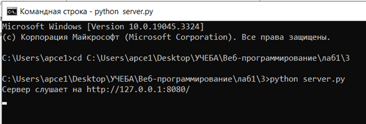
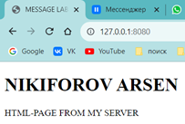

## Задание №3

---
**Задача:**

Реализовать серверную часть приложения. Клиент подключается к серверу. В ответ клиент получает http-сообщение, содержащее html-страницу, которую сервер подгружает из файла index.html. 

Полезные ссылки:

- [http://zetcode.com/python/socket/](http://zetcode.com/python/socket/)
	
**Требования:**

- Обязательно использовать библиотеку socket

---
## Решение

**server.py**
```python
import socket

# Создаем сокет для сервера
server_socket = socket.socket(socket.AF_INET, socket.SOCK_STREAM)

# Указываем IP-адрес и порт, на котором сервер будет слушать
host = "127.0.0.1"  # IP-адрес localhost
port = 8080  # Произвольный порт 

# Привязываем сокет к указанному адресу и порту
server_socket.bind((host, port))

# Начинаем прослушивать соединения
server_socket.listen(1)  # 1 - максимальное количество ожидающих соединений

print(f"Сервер слушает на http://{host}:{port}/")

while True:
    # Принимаем соединение
    client_socket, client_address = server_socket.accept()

    # Читаем запрос от клиента
    request = client_socket.recv(1024).decode()

    # Генерируем HTTP-ответ
    response = """HTTP/1.1 200 OK
Content-Type: text/html

"""

    # Открываем и читаем содержимое файла "index.html"
    with open("index.html", "r") as file:
        response += file.read()

    # Отправляем ответ клиенту
    client_socket.sendall(response.encode())

    # Закрываем соединение с клиентом
    client_socket.close()
```
**Что делает код:**
Код в `server.py` создает простой HTTP-сервер, который прослушивает определенный порт. Когда клиент подключается, сервер отправляет HTML-страницу, содержимое которой хранится в файле `index.html`. Это позволяет клиенту увидеть простую веб-страницу с текстом.

---
##Результат работы программы

**server.py**

- Создается сокет для сервера.
- Указывается IP-адрес и порт для прослушивания.
- Привязывается сокет к указанному адресу и порту.
- Начинается прослушивание соединений.

 В бесконечном цикле:
 
- Принимается соединение от клиента.
- Читается запрос от клиента.
- Формируется HTTP-ответ с содержимым из файла "index.html".
- Отправляется ответ клиенту.
- Закрывается соединение с клиентом.

	
	
	
	
	
**index.html**

простая HTML-страница с заголовком и текстом.

```
<!DOCTYPE html>
<html>
<head>
    <title>MESSAGE LAB1</title>
</head>
<body>
    <h1>NIKIFOROV ARSEN</h1>
    <p>HTML-PAGE FROM MY SERVER</p>
</body>
</html>
```

**Запуск**




Клиентский запрос через порт 8080 подгружает страницу html

